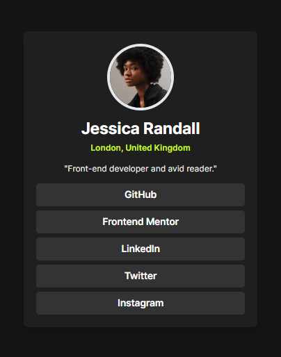

# Social Profile Page

## Overview

The **Social Profile Page** is a sleek and modern web application designed to showcase a user's social profile. It features a clean, responsive layout with a profile image, user information, and direct links to various social media platforms. Built with React and Tailwind CSS, this project demonstrates effective use of styling and responsive design principles to create an engaging user experience.

## Features

- **Profile Display**: Shows a circular profile picture, user name, location, and a brief bio.
- **Social Links**: Provides direct links to GitHub, Frontend Mentor, LinkedIn, Twitter, and Instagram, with hover effects for enhanced interactivity.
- **Responsive Design**: Adapts to different screen sizes for an optimal viewing experience on both mobile and desktop devices.

## Technologies Used

- **React**: A JavaScript library for building user interfaces.
- **Tailwind CSS**: A utility-first CSS framework for custom designs.
- **Vite**: A fast build tool and development server.

## Installation

To get started with this project locally, follow these steps:

1. **Clone the Repository**

   ```bash
   git clone https://github.com/your-username/social-profile-page.git
   cd social-profile-page
   ```

2. **Install Dependencies**

   Ensure you have Node.js and npm installed. Then run:

   ```bash
   npm install
   ```

3. **Start the Development Server**

   ```bash
   npm run dev
   ```

   The application will be accessible at `http://localhost:3000`.

## Usage

Once the development server is running, open your browser and navigate to `http://localhost:3000` to view the Social Profile Page. You can modify the `ProfilePage` component and `index.css` file to customize the appearance and functionality.

## Screenshots

Include screenshots of the application to illustrate its design and functionality. Below is an example placeholder for a screenshot:



## Contributing

Contributions are welcome! Please follow these steps to contribute:

1. **Fork the Repository**
2. **Create a New Branch**
3. **Make Your Changes**
4. **Submit a Pull Request**

## License

This project is licensed under the MIT License. See the [LICENSE](./LICENSE) file for details.

## Acknowledgements

- **React**: [React Documentation](https://reactjs.org/docs/getting-started.html)
- **Tailwind CSS**: [Tailwind CSS Documentation](https://tailwindcss.com/docs)

## Developer Links

-  [**Kenzy Codex Portfolio**](https://kenzycodex.vercel.app)
-  [**Kenzy Codex GitHub**](https://github.com/kenzycodex)
